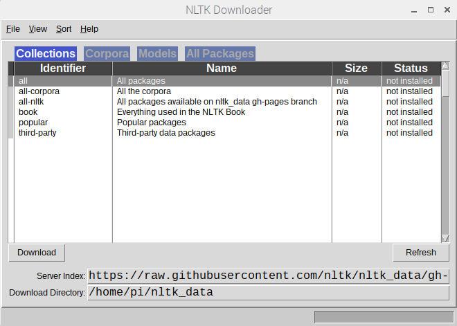

## What you will need

### Hardware

+ A computer with internet connection

### Software

[[[rpi-install-software]]]

+ Python 3
+ Tweepy Python library: `pip3 install tweepy`
+ NLTK Python library: `pip3 install nltk`
  + Following installation of the `nltk` library, download the data you need for it by opening a new Python 3 file, typing in the following, and then running it.
  ```python
  import nltk
  nltk.download()
  ```
  + This will open the NLTK Downloader GUI:
  
  + Double-click on **popular** to download the most popular parts of the library.

